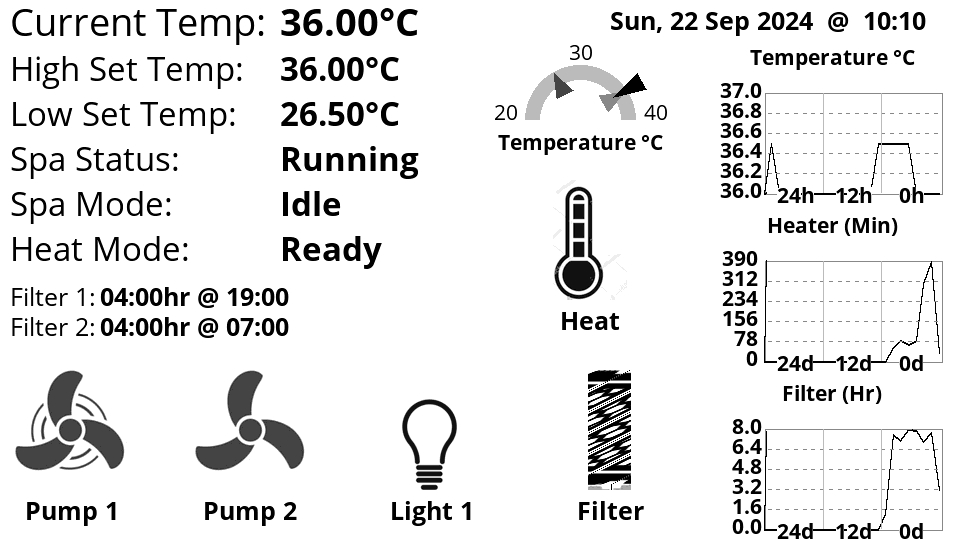
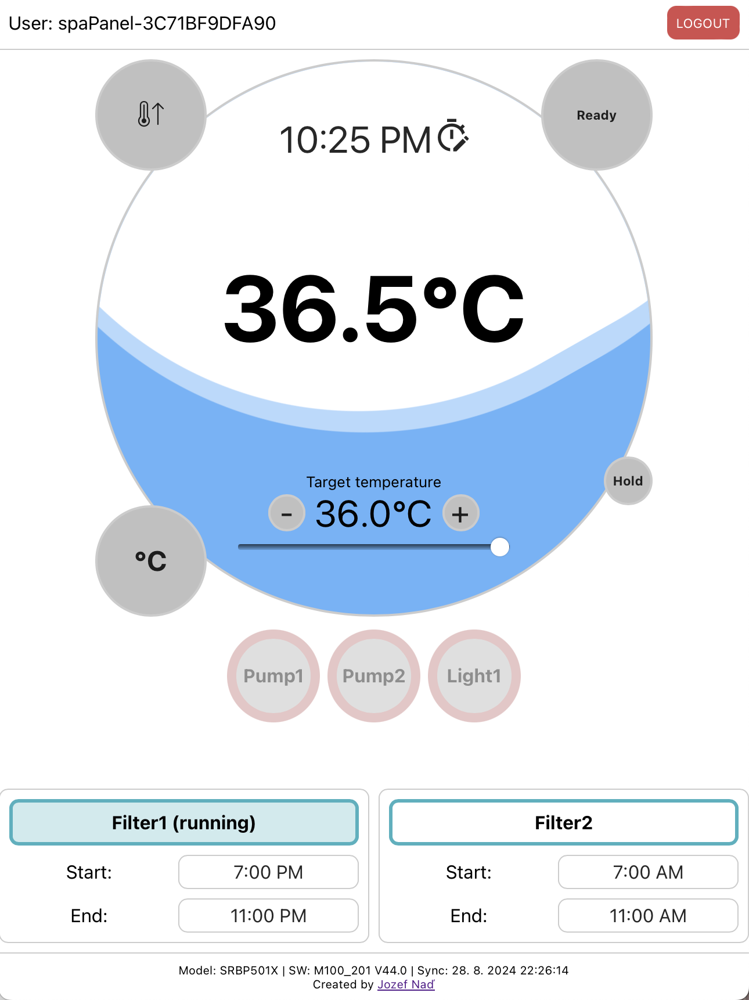

# esp32_balboa_spa

WiFI Enable your Balboa SPA using a ESP32 module connected to your spa controller using rs485 interface to Balboa SPA Controller.

Multimode code base, with multiple user interfaces available.  Interfaces include MQTT, Web and ePaper display.

Code base can also operate in client mode to a remote implementation of the code base in the Hot Tub.  This allows for creating a ePaper display in a central location.

In my setup I have the code base deployed twice, one connected to the Balboa spa controller via rs485.  And a second deployment on a [LilyGo T5 ePaper Display](https://www.lilygo.cc/en-ca/products/t5-4-7-inch-e-paper-v2-3?srsltid=AfmBOopva5B_jxFAsa86Fn75lR66ZpcsqNLJEqPG4Axu8zeuCEEeqI0D) that is mounted to the kitchen so you can see the temperature etc.

## Advanced Features

* Caching of hot tub configuration, to reduce number of calls to SPA Controller and improve responsiveness of client applications
* Hourly tracking of hot tub temperature for 24 hours
* Daily tracking of heater on time in seconds. Keeps 24 days of history
* Daily Tracking of filter on time in seconds.  Keeps 24 days of history

## This is the ePaper display



Display is based on the [LilyGo T5 ePaper Display](https://www.lilygo.cc/en-ca/products/t5-4-7-inch-e-paper-v2-3?srsltid=AfmBOopva5B_jxFAsa86Fn75lR66ZpcsqNLJEqPG4Axu8zeuCEEeqI0D)

## This is the web site
Credit for the code goes to https://github.com/jozefnad/balboa-spa



Currently the WebSite buttons are not working.  I never got around to wiring them up.

## Integration with Homebridge

I have used this with the homebridge plugin [homebridge-plugin-bwaspa](https://github.com/vincedarley/homebridge-plugin-bwaspa) to control and automate my Hot Tub.

## MQTT Interface

MQTT Commands are not working yet.  I never got around to wiring them up.

##  LVGL development 320 * 480

(ESP32S3 LVGL 320 * 480)[https://www.aliexpress.com/item/1005007566332450.html?spm=a2g0o.order_list.order_list_main.4.2c511802JA4XpT]


# Code Base Build

For the build I use platformio.

## Compiler Definitions

  * LOCAL_CLIENT - Connects to a local SPA via rs485 connection
  * REMOTE_CLIENT - Connects to a remote SPA via TCP / WiFi Module interface 
  * LOCAL_CONNECT - Enable discovery of ESP32 module via the Balboa discovery protocol
  * BRIDGE - Enable local TCP Server - Can be leveraged by https://github.com/vincedarley/homebridge-plugin-bwaspa
  * TELNET_LOG - Enables serial logging via a telnet interface
  * spaEpaper - Enables ePaper display

### In spa configuration

For the unit deployed in the spa, and connected to the Balboa spa controller via rs485 I use these compiler definitions.

```
  '-DLOCAL_CONNECT'
  '-DLOCAL_CLIENT'
  '-DBRIDGE'
  '-DTELNET_LOG'
```

### Remote module configuration

This is for the [LilyGo T5 ePaper Display](https://www.lilygo.cc/en-ca/products/t5-4-7-inch-e-paper-v2-3?srsltid=AfmBOopva5B_jxFAsa86Fn75lR66ZpcsqNLJEqPG4Axu8zeuCEEeqI0D)

```
  '-DREMOTE_CLIENT'
  '-DspaEpaper'
```

## Background / History

This is port of the package to run on an ESP32 Device, and modernization of the package

Based on the great work over at \
https://github.com/cribskip/esp8266_spa
https://github.com/ccutrer/balboa_worldwide_app/wiki
https://github.com/ccutrer/balboa_worldwide_app/blob/master/doc/protocol.md


# Original README by cribskip

# esp8266_spa
Control for a Balboa spa controller using the esp8266 (tested on BP2100 and BP601 series)

The sketch connects to the tub, gets an ID and spits out the state to the MQTT broker on topics "Spa/#".
You can control the tub using the subscribed topics, f.e. "Spa/light" with message "ON" for maximum compatability with openhab.

Maybe you need to adjust the sketch to your tub configuration (number of pumps, connection of blower, nr of lights...). You may find the DEBUG comments useful for this task.

Bonus: you may add several relays or such like I did ;-)

# Getting started
- Make sure your Spa is using a Balboa controller
- This is known to work on and developed on a BP2100G0 and BP601 series controllers. Yours may be compatible.
- Get the parts
- Flash the esp8266 fom the Arduino IDE or PlatformIO
- Connect everything together
- Hook up on the Spa
- Enjoy and get tubbin' ;-)

# Parts
- Get a esp8266, perferable a Wemos D1 Pro in case you need to attach a seperate antenna
- RS485 bus transceiver, (for example the "ARCELI TTL To RS485 Adapter 485 Serial Port UART Level Converter Module 3.3V 5V")
- A DC-DC converter for powering from the Tub (LM2596 for example)
- breadboard, wire etc...


# Hardware connections

- Look up finding the right wires on https://github.com/ccutrer/balboa_worldwide_app/wiki#physical-layer
- Connect the DC-DC converter to the supply wires (+ and Ground) from the Tub
- Set the DC-DC converter to output 3.3V. This output voltage (+ Ground) should then connect to the Wemos D1 Mini Pro and the RS485 transceiver
- Connect the RS485 transceiver to the A and B wires
- Connect the esp8266-TX to the RS485 TX
- Connect the esp8266-RX to the RS485 RX


# Debug
- First, check your voltages - the system is running at 3.3V
- The RX (and to some extent the TX) LEDs of the RS485 transceiver (if using the one above) should light up as data goes through. If that is the case you know data is being converted from RS485 to TTL
- The Wemos D1 Mini Pro should spit out data to the MQTT broker (MQTT Spy can be useful here to see: 1. that it is connected to the wifi; 2. that it is connected to the broker). If that is the case, you know the device can communicate over MQTT
- Swap A and B - in my personal experience, if A & B are the wrong way round, the hot tub display (if you have one) will display (NO COMM) as the RS485 traffic get garbled by the esp8266_spa

# Appetiser using OpenHab...


# HomeAssistant integration
The system uses HomeAssistant autodiscover and should just appear in the MQTT Integration under "Esp Spa"


# TODO
- Add more documentation
- Add fault reporting
- Add more setting possibilities (filter cycles, preferences maybe)
